# Application PCA: results
Clement Ponsonnet  

#Application of PCA

## Analysis of decathlon data

This dataset contains the results of decathlon events during two athletic meetings which took place one month apart in 2004: the Olympic Games in Athens (23 and 24 August), and the Decastar 2004 (25 and 26 September). For both competitions, the following information is available for each athlete: performance for each of the 10 events, total number of points (for each event, an athlete earns points based on performance; here the sum of points scored) and final ranking. The events took place in the following order: 100 metres, long jump, shot put, high jump, 400 metres (first day) and 110 metre hurdles, discus, pole vault, javelin, 1500 metres (second day). Nine athletes participated to both competions. We would like to obtain a typology of the performance profiles.

The aim of conducting PCA on this dataset is to determine profiles for similar performances: are there any athletes who are better at endurance events or those requiring short bursts of energy, etc? And are some of the events similar? If an athlete performs well in one event, will he necessarily perform well in another?

We install libraries and get the data
The data can be found with:


```r
library(FactoMineR)
library(dplyr)
data(decathlon)
```

**1- Have a quick look at the centered and scaled data, what can be said?**

We need to scale the data when the variables are expressed at different order of magnitude. Otherwise, the principal component is likely to be the variable which has the highest variance.


```r
dec <- decathlon %>%
  select(-Competition)

dec_scaled <- scale(dec)
head(dec_scaled)
```

```
##                100m  Long.jump   Shot.put   High.jump       400m
## SEBRLE   0.15949639  1.0113727  0.4280870  1.04744448  0.1678949
## CLAY    -0.90504930  0.4424756 -0.2633016 -1.31341860 -0.2135691
## KARPOV   0.08345742  0.1264216  0.3553093  0.71017832 -1.0805328
## BERNARD  0.08345742 -0.0948162 -0.2754312 -0.63888629 -0.5950331
## YURKOV   1.30008106 -0.5372918  0.8647535  1.38471063  0.6967428
## WARNERS  0.42563282  1.0745835 -0.2026535  0.03564602 -0.8117741
##         110m.hurdle     Discus Pole.vault   Javeline       1500m
## SEBRLE    0.1783559 -0.1704074  0.9264789  1.0096532  1.08582657
## CLAY     -1.1781827  1.8930385  0.5667665  0.3798390  1.92535303
## KARPOV   -1.0933990  1.3690358  0.5667665 -1.6587702  1.81398728
## BERNARD   0.8142333 -1.0230221  2.0056163  0.9226394  0.09210136
## YURKOV    1.4925026  0.5726700 -0.1526585  1.0614472 -0.22486271
## WARNERS  -0.7966562 -0.9549313  0.5667665 -1.3562936 -0.07923057
##               Rank     Points
## SEBRLE  -1.4044731 0.61811720
## CLAY    -1.2781937 0.34065189
## KARPOV  -1.1519144 0.27347608
## BERNARD -1.0256350 0.18001408
## YURKOV  -0.8993556 0.08947277
## WARNERS -0.7730762 0.07194864
```


**2 - Explain your choices for the active and illustrative variables/individuals and perform the PCA on this data set.**

We will choose Rank, Point (and maybe Competition) as illustrative, and all other variables as active. This because rank and point depend on all the other variables.


```r
res.pca <- PCA(decathlon, scale = T, quanti.sup = c(11,12), quali.sup = c(13))
```

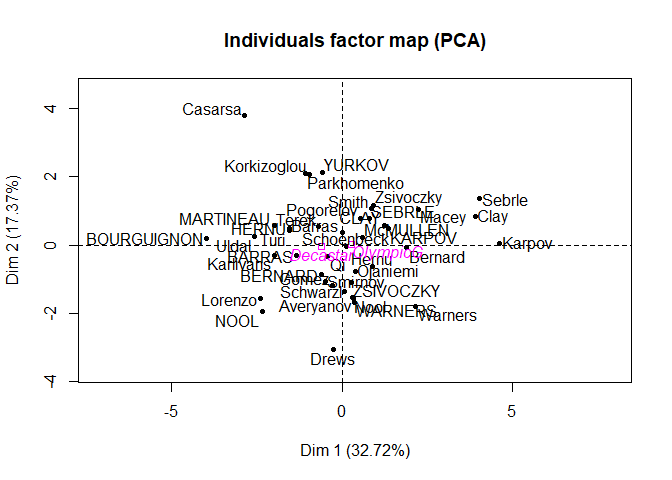<!-- -->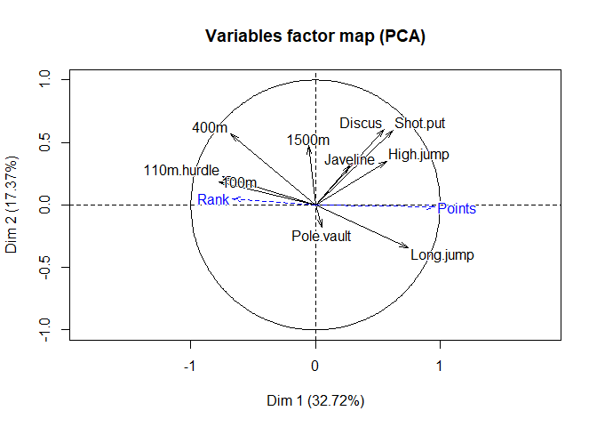<!-- -->

```r
summary(res.pca)
```

```
## 
## Call:
## PCA(X = decathlon, scale.unit = T, quanti.sup = c(11, 12), quali.sup = c(13)) 
## 
## 
## Eigenvalues
##                        Dim.1   Dim.2   Dim.3   Dim.4   Dim.5   Dim.6
## Variance               3.272   1.737   1.405   1.057   0.685   0.599
## % of var.             32.719  17.371  14.049  10.569   6.848   5.993
## Cumulative % of var.  32.719  50.090  64.140  74.708  81.556  87.548
##                        Dim.7   Dim.8   Dim.9  Dim.10
## Variance               0.451   0.397   0.215   0.182
## % of var.              4.512   3.969   2.148   1.822
## Cumulative % of var.  92.061  96.030  98.178 100.000
## 
## Individuals (the 10 first)
##                 Dist    Dim.1    ctr   cos2    Dim.2    ctr   cos2  
## SEBRLE      |  2.369 |  0.792  0.467  0.112 |  0.772  0.836  0.106 |
## CLAY        |  3.507 |  1.235  1.137  0.124 |  0.575  0.464  0.027 |
## KARPOV      |  3.396 |  1.358  1.375  0.160 |  0.484  0.329  0.020 |
## BERNARD     |  2.763 | -0.610  0.277  0.049 | -0.875  1.074  0.100 |
## YURKOV      |  3.018 | -0.586  0.256  0.038 |  2.131  6.376  0.499 |
## WARNERS     |  2.428 |  0.357  0.095  0.022 | -1.685  3.986  0.482 |
## ZSIVOCZKY   |  2.563 |  0.272  0.055  0.011 | -1.094  1.680  0.182 |
## McMULLEN    |  2.561 |  0.588  0.257  0.053 |  0.231  0.075  0.008 |
## MARTINEAU   |  3.742 | -1.995  2.968  0.284 |  0.561  0.442  0.022 |
## HERNU       |  2.794 | -1.546  1.782  0.306 |  0.488  0.335  0.031 |
##              Dim.3    ctr   cos2  
## SEBRLE       0.827  1.187  0.122 |
## CLAY         2.141  7.960  0.373 |
## KARPOV       1.956  6.644  0.332 |
## BERNARD      0.890  1.375  0.104 |
## YURKOV      -1.225  2.606  0.165 |
## WARNERS      0.767  1.020  0.100 |
## ZSIVOCZKY   -1.283  2.857  0.250 |
## McMULLEN    -0.418  0.303  0.027 |
## MARTINEAU   -0.730  0.925  0.038 |
## HERNU        0.841  1.227  0.091 |
## 
## Variables
##                Dim.1    ctr   cos2    Dim.2    ctr   cos2    Dim.3    ctr
## 100m        | -0.775 18.344  0.600 |  0.187  2.016  0.035 | -0.184  2.420
## Long.jump   |  0.742 16.822  0.550 | -0.345  6.869  0.119 |  0.182  2.363
## Shot.put    |  0.623 11.844  0.388 |  0.598 20.607  0.358 | -0.023  0.039
## High.jump   |  0.572  9.998  0.327 |  0.350  7.064  0.123 | -0.260  4.794
## 400m        | -0.680 14.116  0.462 |  0.569 18.666  0.324 |  0.131  1.230
## 110m.hurdle | -0.746 17.020  0.557 |  0.229  3.013  0.052 | -0.093  0.611
## Discus      |  0.552  9.328  0.305 |  0.606 21.162  0.368 |  0.043  0.131
## Pole.vault  |  0.050  0.077  0.003 | -0.180  1.873  0.033 |  0.692 34.061
## Javeline    |  0.277  2.347  0.077 |  0.317  5.784  0.100 | -0.390 10.807
## 1500m       | -0.058  0.103  0.003 |  0.474 12.946  0.225 |  0.782 43.543
##               cos2  
## 100m         0.034 |
## Long.jump    0.033 |
## Shot.put     0.001 |
## High.jump    0.067 |
## 400m         0.017 |
## 110m.hurdle  0.009 |
## Discus       0.002 |
## Pole.vault   0.479 |
## Javeline     0.152 |
## 1500m        0.612 |
## 
## Supplementary continuous variables
##                Dim.1   cos2    Dim.2   cos2    Dim.3   cos2  
## Rank        | -0.671  0.450 |  0.051  0.003 | -0.058  0.003 |
## Points      |  0.956  0.914 | -0.017  0.000 | -0.066  0.004 |
## 
## Supplementary categories
##                 Dist    Dim.1   cos2 v.test    Dim.2   cos2 v.test  
## Decastar    |  0.946 | -0.600  0.403 -1.430 | -0.038  0.002 -0.123 |
## OlympicG    |  0.439 |  0.279  0.403  1.430 |  0.017  0.002  0.123 |
##              Dim.3   cos2 v.test  
## Decastar     0.289  0.093  1.050 |
## OlympicG    -0.134  0.093 -1.050 |
```

```r
plot(res.pca, choix = "ind", axes = c(1,2))
```

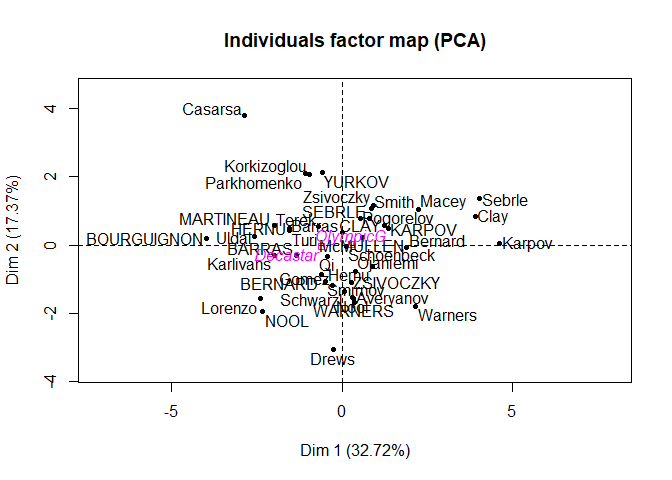<!-- -->

```r
plot(res.pca, choix = "var", axes = c(1,2))
```

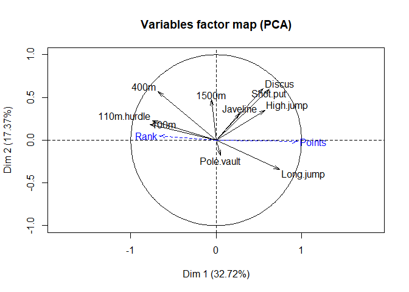<!-- -->


**3 - Comment the percentage of variability explained by the two first dimensions. What would you like (a small percentage, a high percentage) and why?**


```r
round(res.pca$eig,2)
```

```
##         eigenvalue percentage of variance
## comp 1        3.27                  32.72
## comp 2        1.74                  17.37
## comp 3        1.40                  14.05
## comp 4        1.06                  10.57
## comp 5        0.68                   6.85
## comp 6        0.60                   5.99
## comp 7        0.45                   4.51
## comp 8        0.40                   3.97
## comp 9        0.21                   2.15
## comp 10       0.18                   1.82
##         cumulative percentage of variance
## comp 1                              32.72
## comp 2                              50.09
## comp 3                              64.14
## comp 4                              74.71
## comp 5                              81.56
## comp 6                              87.55
## comp 7                              92.06
## comp 8                              96.03
## comp 9                              98.18
## comp 10                            100.00
```


We have 33% + 17% = 50 % of variability explained by the first two dimensions. This means that projecting our data on these two dimensions conserves 50 % of the total variability of our data set. We want this number to be as high possible: this would mean we have found a good dimensionality reduction of our data.

50% seems low, but we should take into account the number of dimensions the PCA is performed on. We can compare this percentage 0.95-quantile of the distribution of the percentages obtained by simulating data tables of equivalent size on the basis of a normal distribution. According to the table below, this quantile obtained for 40 individuals and 10 variables is worth 38%:  
Even if the percentage of 50% seems relatively low, it expresses a significant structure in the data.


###Interpretation

**Here are different observations based on the results of our PCA**

If we look at the correlation circle (variables factor map), we see notice that :

* *100m* and *long.jump* are negatively correlated. So an athlete who runs 100 metres quickly will generally jump a long way, which indicates a good performance in both sports
* The variables *100m*, *400m*, and *110m* hurdles are positively correlated, that is, some athletes perform well in all four events (including *long.jump*) while others perform badly in all four.
* By looking at the length of the vectors in the correlation circle, we see that *long.jump* is well represented in the first plane and Pole.vault is not. We can deduce that long.jump and Pole.vault are approximately orthogonal, meaning that the corresponding variables are roughly uncorrelated.

Overall, the variables relating to speed are negatively correlated with the first principal component while the variables shot put and long jump are positively correlated with this component.


```r
round(cbind(res.pca$var$coord[,1:4],res.pca$var$cos2[,1:4], res.pca$var$contrib[,1:4]),2)
```

```
##             Dim.1 Dim.2 Dim.3 Dim.4 Dim.1 Dim.2 Dim.3 Dim.4 Dim.1 Dim.2
## 100m        -0.77  0.19 -0.18 -0.04  0.60  0.04  0.03  0.00 18.34  2.02
## Long.jump    0.74 -0.35  0.18  0.10  0.55  0.12  0.03  0.01 16.82  6.87
## Shot.put     0.62  0.60 -0.02  0.19  0.39  0.36  0.00  0.04 11.84 20.61
## High.jump    0.57  0.35 -0.26 -0.14  0.33  0.12  0.07  0.02 10.00  7.06
## 400m        -0.68  0.57  0.13  0.03  0.46  0.32  0.02  0.00 14.12 18.67
## 110m.hurdle -0.75  0.23 -0.09  0.29  0.56  0.05  0.01  0.08 17.02  3.01
## Discus       0.55  0.61  0.04 -0.26  0.31  0.37  0.00  0.07  9.33 21.16
## Pole.vault   0.05 -0.18  0.69  0.55  0.00  0.03  0.48  0.30  0.08  1.87
## Javeline     0.28  0.32 -0.39  0.71  0.08  0.10  0.15  0.51  2.35  5.78
## 1500m       -0.06  0.47  0.78 -0.16  0.00  0.22  0.61  0.03  0.10 12.95
##             Dim.3 Dim.4
## 100m         2.42  0.14
## Long.jump    2.36  0.98
## Shot.put     0.04  3.44
## High.jump    4.79  1.74
## 400m         1.23  0.08
## 110m.hurdle  0.61  8.00
## Discus       0.13  6.38
## Pole.vault  34.06 28.78
## Javeline    10.81 48.00
## 1500m       43.54  2.46
```

By looking at the Individuals Factor Map, we see that:

* *The athlete Casarsa has an atypical profile in the sense that his results are extreme for both the first and the second principal component *
* *Bourguignon and Karpov have very different performance profiles since they are opposed along the first axis / component*
* *Sebrle and Clay have similar profiles since they are close on the individuals factor map, which corresponds to a projection along the first two principal components*

**We can enhance the graphical outputs with the following options:**


```r
plot.PCA(res.pca, choix = "ind", habillage = ncol(decathlon), cex = 0.7)
```

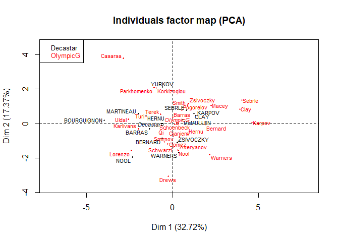<!-- -->

```r
plot.PCA(res.pca, choix = "ind", habillage = ncol(decathlon), cex = 0.7, 
         autoLab = "no")
```

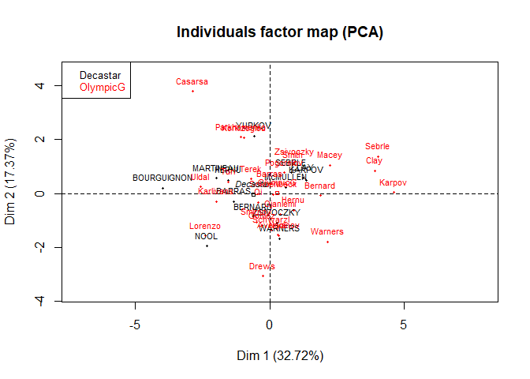<!-- -->

```r
plot(res.pca, select = "cos2 0.8",  invisible = "quali")
```

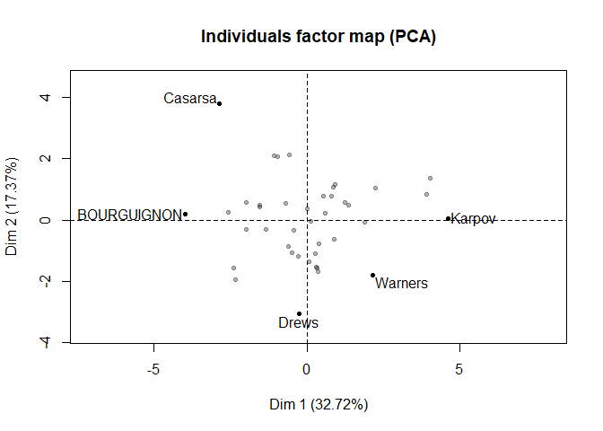<!-- -->

```r
plot(res.pca, select = "contrib 10")
```

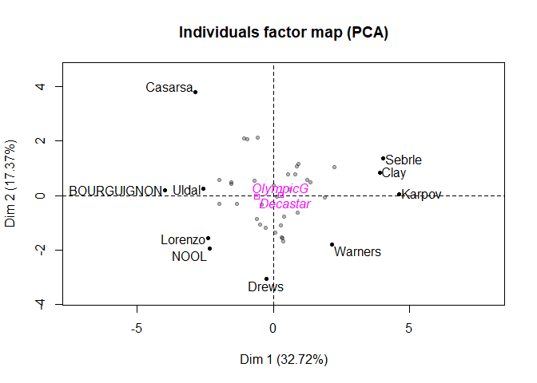<!-- -->

```r
plot(res.pca, choix = "var", select = "contrib 8", unselect = 0)
```

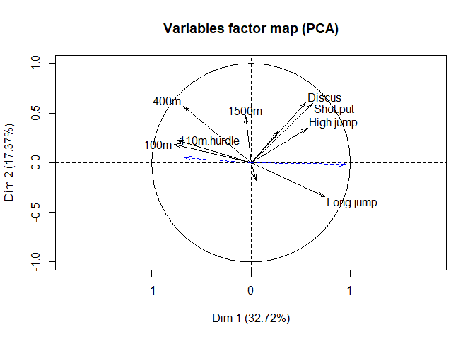<!-- -->

```r
plot(res.pca, choix = "var", select = c("400m", "1500m"))
```

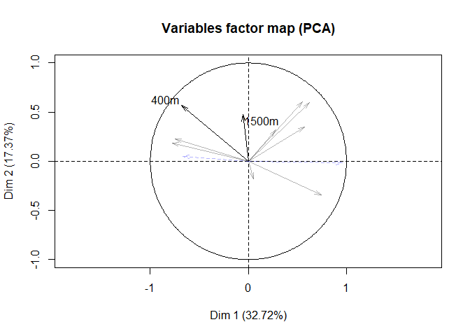<!-- -->

**6. In which trials those who win the decathlon perform the best? Could we say that the decathlon trials are well selected?**

We saw on the correlation circle that the supplementary variable "number of points"  is almost collinear to the first direction. This means that those who wim the decathlon perform well in the sports that are correlated to the first principal component.


```r
res.pca$var$coord
```

```
##                   Dim.1      Dim.2       Dim.3       Dim.4       Dim.5
## 100m        -0.77471983  0.1871420 -0.18440714 -0.03781826  0.30219639
## Long.jump    0.74189974 -0.3454213  0.18221105  0.10178564  0.03667805
## Shot.put     0.62250255  0.5983033 -0.02337844  0.19059161  0.11115082
## High.jump    0.57194530  0.3502936 -0.25951193 -0.13559420  0.55543957
## 400m        -0.67960994  0.5694378  0.13146970  0.02930198 -0.08769157
## 110m.hurdle -0.74624532  0.2287933 -0.09263738  0.29083103  0.16432095
## Discus       0.55246652  0.6063134  0.04295225 -0.25967143 -0.10482712
## Pole.vault   0.05034151 -0.1803569  0.69175665  0.55153397  0.32995932
## Javeline     0.27711085  0.3169891 -0.38965541  0.71227728 -0.30512892
## 1500m       -0.05807706  0.4742238  0.78214280 -0.16108904 -0.15356189
```

We see that the sports which are most associated to the first principal component are 100m, 400 m, 110m.hurdle, and Long.jump . This could indicate that the decathlon trials and point system are not well chosen since they favor short distance runners. 
**We can further investigate which sports contribute most to the first 4 dimensions with the following function.**


```r
dimdesc(res.pca, 1:4)
```

```
## $Dim.1
## $Dim.1$quanti
##             correlation      p.value
## Points        0.9561543 2.099191e-22
## Long.jump     0.7418997 2.849886e-08
## Shot.put      0.6225026 1.388321e-05
## High.jump     0.5719453 9.362285e-05
## Discus        0.5524665 1.802220e-04
## Rank         -0.6705104 1.616348e-06
## 400m         -0.6796099 1.028175e-06
## 110m.hurdle  -0.7462453 2.136962e-08
## 100m         -0.7747198 2.778467e-09
## 
## 
## $Dim.2
## $Dim.2$quanti
##           correlation      p.value
## Discus      0.6063134 2.650745e-05
## Shot.put    0.5983033 3.603567e-05
## 400m        0.5694378 1.020941e-04
## 1500m       0.4742238 1.734405e-03
## High.jump   0.3502936 2.475025e-02
## Javeline    0.3169891 4.344974e-02
## Long.jump  -0.3454213 2.696969e-02
## 
## 
## $Dim.3
## $Dim.3$quanti
##            correlation      p.value
## 1500m        0.7821428 1.554450e-09
## Pole.vault   0.6917567 5.480172e-07
## Javeline    -0.3896554 1.179331e-02
## 
## 
## $Dim.4
## $Dim.4$quanti
##            correlation      p.value
## Javeline     0.7122773 1.761578e-07
## Pole.vault   0.5515340 1.857748e-04
```
For each dimension, only the sports with a significant correlation to that dimension are described.

We see that the first dimension depends mostly on the supplementary variable number of points (correlation of .96), and the active variable 100m (correlation of -.77).  
Similarly, the second dimension depends mostly on discus and shot.put.

No categories of any categorical variables significantly characterise components 1 through 4 (at a confidence level of .95).

**8. Compare and comment the performances during both events: Decastar and Olympic. Could we conclude on the differences? Plot confidence ellipses or perfom a test:**


```r
plotellipses(res.pca, label="none")
```

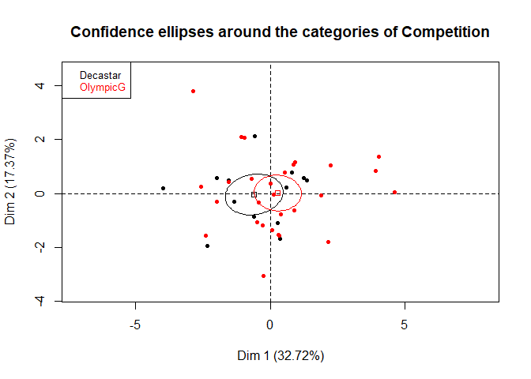<!-- -->

Since the confidence ellipses overlap, there is no significant difference in performance between Decastar and Olympic Games. This was taken at confidence level .95

Even at a level of .50, the confidence regions overlap

```r
plotellipses(res.pca, label="none", level = .5)
```

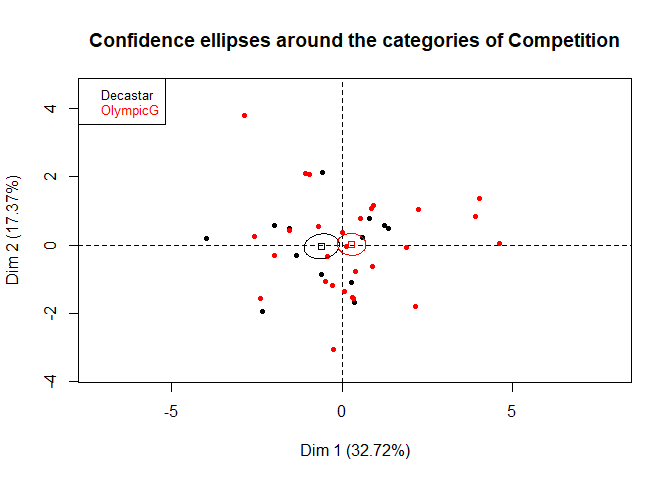<!-- -->


**To select the optimal number of levels, we can use the "estim_ncp" function in the FactoMineR package, which uses a cross-validation method to choose the number of components**


```r
estim_ncp(decathlon[,c(1:10)])
```

```
## $ncp
## [1] 3
## 
## $criterion
##  [1] 1.0000000 0.8956157 0.8856886 0.8767187 0.8890351 0.9877073 1.1040511
##  [8] 1.3284635 1.5897203 3.1098135
```

Here the optimal number of dimensions is 3. For an overview of the method used to find this number, see [this article](https://pdfs.semanticscholar.org/76e5/dc096446dbc18b5df6a88f72a1ddb379c48b.pdf).

###Summary: general interpetation###

The representations of both the cloud of individuals and the cloud of variables are to be analysed together. In other words, differences between individuals can be explained by the variables, and relationships between variables can be illustrated by individuals. On the whole, the first component opposes performance profiles that are uniformly high" (i.e., athletes that are good in all events) such as Karpov at the Olympics to performance profiles that are (relatively!) weak in all events such as Bourguignon at the Decastar meeting.

Furthermore, the first component is mainly linked to the events using qualities relating to a burst of energy (100m, 400m, 110m hurdles and long jump). These four variables constitute a relatively homogeneous group: the correlation between any two of these performances is higher than 0.52 (see the correlation matrix). With just one exception, these variables have the highest coefficients. This group of variables contributes to the first principal component and the overall score. It must here be emphasised that the first principal component is the combination that best sums up all the variables. In this example, the automatic summary provided by the PCA corresponds almost exactly with the official summary (the number of points).

The second component opposes the variables of endurance (400m and 1500m) and power (discus, shot put). Notably, it separates the performance profiles that are considered weak, which suggests that the best performance profiles are balanced: even among the weakest profiles, athletes can be specialised. Note that power (discus and shot put) is not correlated with speed (100m, long jump, 110m hurdles).  
As these two variables are not linearly related, there are powerful and fast individuals (all-round athletes with high values on the first component), powerful individuals who are not so fast (corresponding to high values on component 2) and individuals who are not powerful but fast (with low coordinates on component 2).   The variable number of points seems to be entirely unrelated to the 2nd component (correlation of 0.02, see list of coordinates of the supplementary variables).

The third component is mainly related to the 1500 metres and to a lesser extent, to the pole vault. It opposes these two events: athletes that do not perform well in the 1500 metres (N.B. as it is a variable relating to speed, a high value indicates rather poor performance) do however obtain good results in the pole vault (i.e., see standardised values in the centered and scaled data for Terek: 1.96 in the pole vault and 0.98 in the 1500 metres). This third component mainly highlights four individuals that are particularly weak in the 1500 metres.  

The fourth component is correlated with the variable javelin and, to a lesser extent, the variable pole vault. 

All athletes who participated in both decathlons certainly focused their physical preparation on their performances at the Olympic Games. Indeed, they all performed better at the Olympic Games than at the Decastar meeting. We can see that the dots representing a single athlete (for example, Sebrle) are in roughly the same direction. This means, for example, that Sebrle is good at the same events for both decathlons, but that the dot corresponding to his performance at the Olympic Games is more extreme, so he obtained more points during the Olympics than at the Decastar meeting.

This data can be interpreted in two different ways:
Athletes that participate in the Olympic Games perform better (on average) than those participating in the Decastar meeting.
During the Olympics, athletes are more motivated by the challenge, they tend to better, etc.
